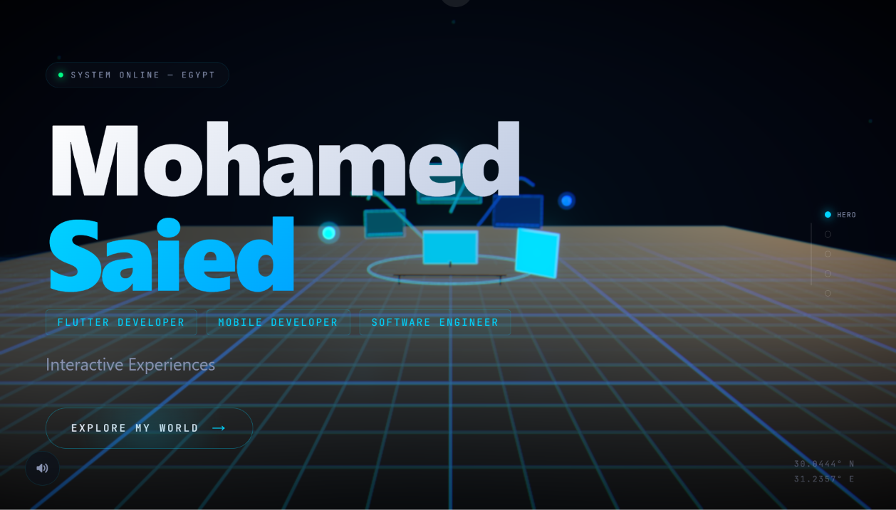

# 🚀 Mohamed Saied — Interactive 3D Portfolio

<p align="center">
  
</p>

An immersive, award-inspired 3D portfolio showcasing my work as a **Software Engineer** and **Flutter Developer** through cinematic animations and interactive experiences.


## ✨ Features

- 🎬 One-page cinematic scrolling experience
- 🌍 Immersive 3D scenes built with Three.js
- ⚡ Smooth camera transitions and animations
- 📱 Fully responsive design
- 🚀 Optimized performance
- 🎨 Modern UI with premium visual effects
- 💼 Interactive showcase of real-world projects

## 🛠️ Tech Stack

- Next.js 15
- TypeScript
- React Three Fiber
- Three.js
- @react-three/drei
- GSAP
- Framer Motion
- Lenis
- Tailwind CSS v4

## 📂 Featured Projects

- 🛴 Glider — Smart Scooter Rental Platform
- 💼 Shoghlany — Job Recruitment Platform
- 🌊 Underwater ROV
- 🤖 Robotic Arm
- 🚗 Smart Parking System
- 🌦️ Weather Application

## 🚀 Getting Started

```bash
npm install
npm run dev
```

Open:

```
http://localhost:3000
```

## 📦 Production

```bash
npm run build
npm run start
```

## ⚙️ Customization

| Item                | File                   |
| ------------------- | ---------------------- |
| Contact Information | `src/data/contact.ts`  |
| Projects            | `src/data/projects.ts` |
| Skills              | `src/data/skills.ts`   |
| Statistics          | `src/data/stats.ts`    |
| SEO URL             | `.env.local`           |

## 🌐 Deployment

Deploy easily on **Vercel** or any Node.js hosting provider.

## 📸 Preview

Add screenshots or a GIF here to showcase the experience.

## 📄 License

This project is licensed under the MIT License.
